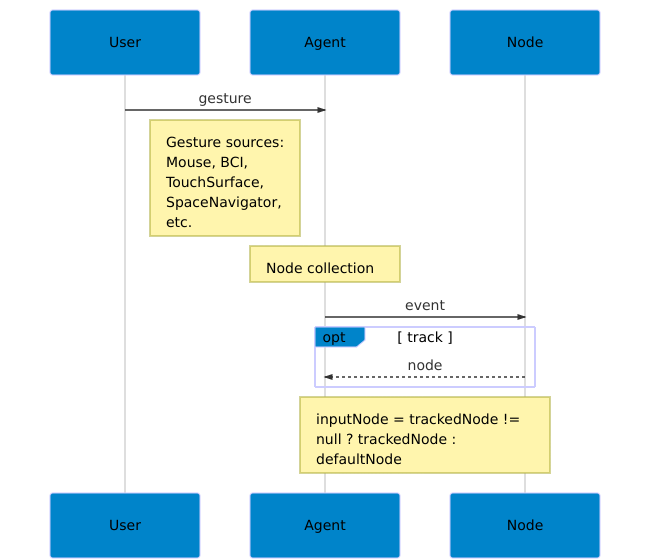
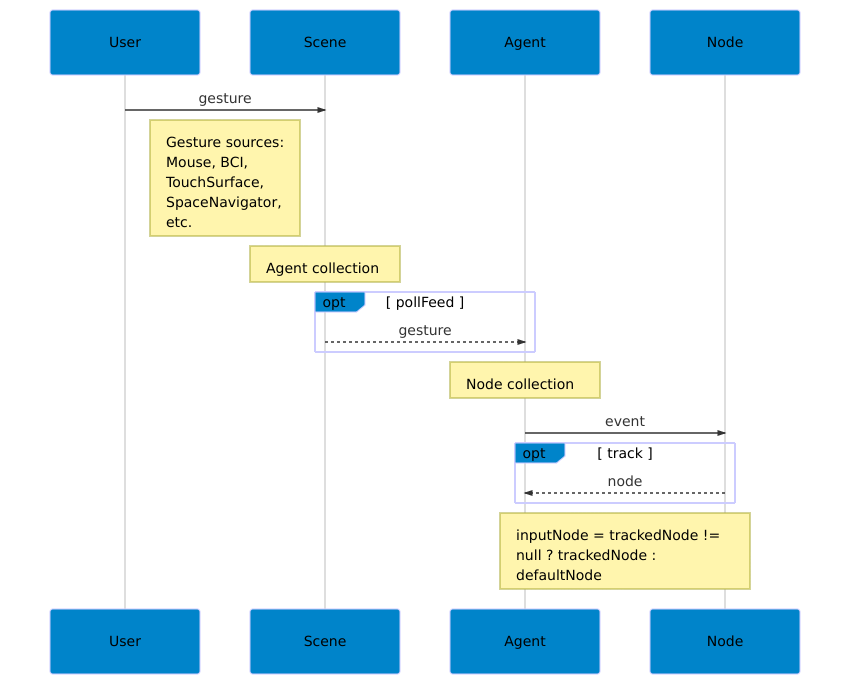
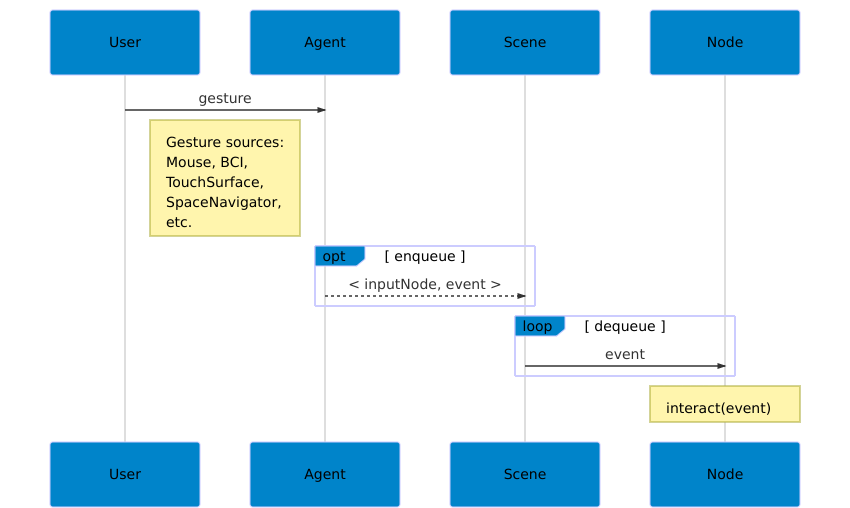
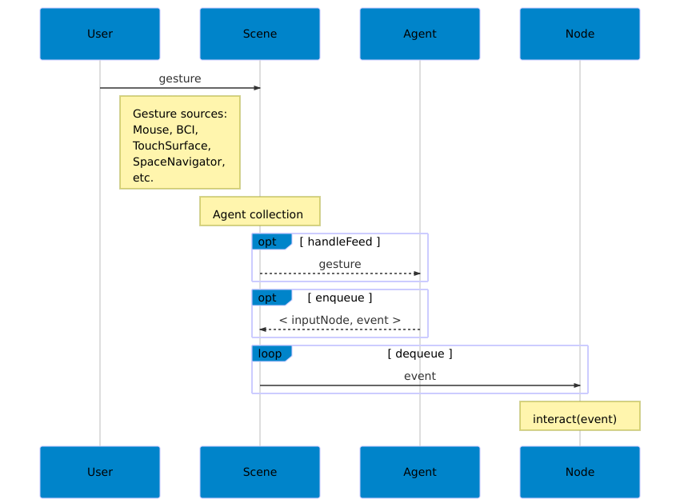

<section id="themes">
	<h2>Themes</h2>
		<p>
			Set your presentation theme: <br>
			<!-- Hacks to swap themes after the page has loaded. Not flexible and only intended for the reveal.js demo deck. -->
			<a href="#" onclick="document.getElementById('theme').setAttribute('href','css/theme/black.css'); return false;">Black (default)</a> -
			<a href="#" onclick="document.getElementById('theme').setAttribute('href','css/theme/white.css'); return false;">White</a> -
			<a href="#" onclick="document.getElementById('theme').setAttribute('href','css/theme/league.css'); return false;">League</a> -
			<a href="#" onclick="document.getElementById('theme').setAttribute('href','css/theme/sky.css'); return false;">Sky</a> -
			<a href="#" onclick="document.getElementById('theme').setAttribute('href','css/theme/beige.css'); return false;">Beige</a> -
			<a href="#" onclick="document.getElementById('theme').setAttribute('href','css/theme/simple.css'); return false;">Simple</a> <br>
			<a href="#" onclick="document.getElementById('theme').setAttribute('href','css/theme/serif.css'); return false;">Serif</a> -
			<a href="#" onclick="document.getElementById('theme').setAttribute('href','css/theme/night.css'); return false;">Night</a> -
			<a href="#" onclick="document.getElementById('theme').setAttribute('href','css/theme/moon.css'); return false;">Moon</a> -
			<a href="#" onclick="document.getElementById('theme').setAttribute('href','css/theme/solarized.css'); return false;">Solarized</a>
		</p>
</section>

H:

# Interaction in [frames](https://github.com/VisualComputing/framesjs)

Jean Pierre Charalambos

H:

# Index

 1. Goal <!-- .element: class="fragment" data-fragment-index="1"-->
 2. Frames' design<!-- .element: class="fragment" data-fragment-index="2"-->
 3. Applications<!-- .element: class="fragment" data-fragment-index="3"-->
 4. Future work<!-- .element: class="fragment" data-fragment-index="4"-->
 
H:

## Goal

Provide _interactivity_ to _application objects_ from any _input source_

in the 'simplest' possible way <!-- .element: class="fragment" data-fragment-index="1"-->

V:

## Goal: Main interaction tasks

Three main interaction tasks (see ['A Survey of Interaction Techniques for Interactive 3D Environments', Jankowski et al](https://hal.inria.fr/hal-00789413/)):

<li class="fragment"> Navigation
<li class="fragment"> Picking and manipulation
<li class="fragment"> Application control

V:

## Goal: Main interaction tasks
### 1. 2D & 3D Navigation

Basic camera types:

<li class="fragment"> Orbit-like methods
<li class="fragment"> First person
<li class="fragment"> Third person

V:

## Goal: Main interaction tasks
### 2. Picking & Manipulation

<li class="fragment"> Picking strategies: from input sources, programmatically
<li class="fragment"> Manipulation: emulate 6 DOF's (Default behavior from multiple _input Sources_)

V:

## Goal: Main interaction tasks
### 3. Application control (custom behaviors)

Post-WIMP interaction styles
<li class="fragment"> Interfaces “containing at least one interaction technique
not dependent on classical 2D widgets” [[van Dam]](http://dl.acm.org/citation.cfm?id=253708), such as:
<li class="fragment"> Virtual, mixed and augmented reality
<li class="fragment"> [Tangible interaction](https://en.wikipedia.org/wiki/Tangible_user_interface), ubiquitous and pervasive computing, context-aware computing
<li class="fragment"> Handheld, or mobile interaction
<li class="fragment"> Perceptual and [affective computing](https://en.wikipedia.org/wiki/Affective_computing)
  
N:

WIMP: "window, icon, menu, pointing device"
classical 2D widgets:  menus and icons

H:

## [Frames](https://github.com/VisualComputing/framesjs) Design: API considerations

<li class="fragment"> Simplicity: Separate _application object_ behaviors from _input sources_
<li class="fragment"> Flexibility: Simple default (common) behaviors vs challenging ones

V:

## [Frames](https://github.com/VisualComputing/framesjs) Design

<li class="fragment"> _Application objects_ -> *Nodes*
<li class="fragment"> _Input source_ -> *Agents*
<li class="fragment"> Common _event interface_ -> *Events*

V:

## [Frames](https://github.com/VisualComputing/framesjs) Design
### Events

Formatted _interface_ between input sources and nodes

V:

## [Frames](https://github.com/VisualComputing/framesjs) Design
### Events: Types

 * KeyEvent <!-- .element: class="fragment" data-fragment-index="1"-->
 * TapEvent <!-- .element: class="fragment" data-fragment-index="2"-->
 * MotionEvent <!-- .element: class="fragment" data-fragment-index="3"-->
   * MotionEvent1
   * MotionEvent2
   * MotionEvent3
   * MotionEvent6

V:

## [Frames](https://github.com/VisualComputing/framesjs) Design
### Events: properties

<li class="fragment"> Every _event_ encapsulates a ```Shortcut```
<li class="fragment"> A ```flushed()``` event encapsulates a gesture termination message
<li class="fragment"> Motion events are ```relative``` or ```absolute``` and they have ```speed``` and ```delay```
<li class="fragment"> Events are _extensible_

V:

## [Frames](https://github.com/VisualComputing/framesjs) Design
### Nodes are Grabbers

```java
public interface Grabber {
	/**
	 * Defines the rules to set the application object as
	 * an input grabber.
	 */
	boolean track(Event event);

	/**
	 * Defines how the application object should behave
	 * according to a given BogusEvent, which may hold
	 * a user-defined action.
	 */
	void Interact(Event event);
}

```

V:

## [Frames](https://github.com/VisualComputing/framesjs) Design
### Agents

Collect and reduce input into a _event_ in order to:

<li class="fragment"> Update the _Grabber_ (```agent.inputGrabber()```)
<li class="fragment"> Perform an interaction on the ```agent.inputGrabber()```

V:

## [Frames](https://github.com/VisualComputing/framesjs) Design
### Agents: `poll(event)`

<figure>
    
    <figcaption>Agents: `poll(event)`</figcaption>
</figure>

V:

## [Frames](https://github.com/VisualComputing/framesjs) Design
### Agents: `event pollFeed()`

<figure>
    
    <figcaption>Agents: `event pollFeed()`</figcaption>
</figure>

V:

## [Frames](https://github.com/VisualComputing/framesjs) Design
### Agents: `handle(event)`

<figure>
    
    <figcaption>Agents: `handle(event)`</figcaption>
</figure>

V:

## [Frames](https://github.com/VisualComputing/framesjs) Design
### Agents: `event handleFeed()`

<figure>
    
    <figcaption>Agents: `event handleFeed()`</figcaption>
</figure>

H:

## Applications

* Navigation
* Picking and manipulation
* Application control

V:

## Applications
### Navigation

<li class="fragment"> Orbit-like methods: all examples using a mouse
<li class="fragment"> First person: first person
<li class="fragment"> Third person: [FlockOfBoids](https://github.com/VisualComputing/framesjs/tree/processing/examples/Advanced/FlockOfBoids)

V:

## Applications
### Picking

<li class="fragment"> `FIXED` picking precision, [FlockOfBoids](https://github.com/VisualComputing/framesjs/tree/processing/examples/Advanced/FlockOfBoids)
<li class="fragment"> `ADAPTIVE` picking precision, [CajasOrientadas](https://github.com/VisualComputing/framesjs/tree/processing/examples/Advanced/CajasOrientadas)
<li class="fragment"> `EXACT` picking precision, [PostEffects](https://github.com/VisualComputing/framesjs/tree/processing/examples/Demos/PostEffects)

V:

## Applications
### Manipulation

<li class="fragment"> All examples involving the [mouse]() (default _agent_)
<li class="fragment"> [Space Navigator](https://github.com/VisualComputing/framesjs/tree/processing/examples/Demos/SpaceNavigator) (custom _agent_)
<li class="fragment"> [Kinect 6-DOF cemera control](https://www.youtube.com/watch?v=G8SEzFMmMyI) (custom _agent_)

V:

## Applications

Application control: [deformation](https://github.com/nakednous/Deformation)

H:

## References

* ['A Survey of Interaction Techniques for Interactive 3D Environments', Jankowski et al](https://hal.inria.fr/hal-00789413/)
* [Proscene: A feature-rich framework for interactive environments](https://www.sciencedirect.com/science/article/pii/S235271101730002X?_rdoc=1&_fmt=high&_origin=gateway&_docanchor=&md5=b8429449ccfc9c30159a5f9aeaa92ffb)
